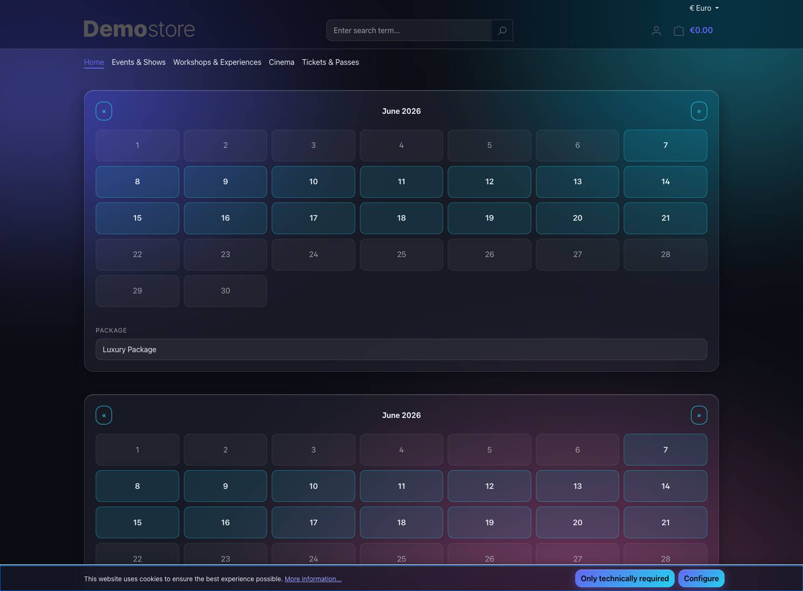
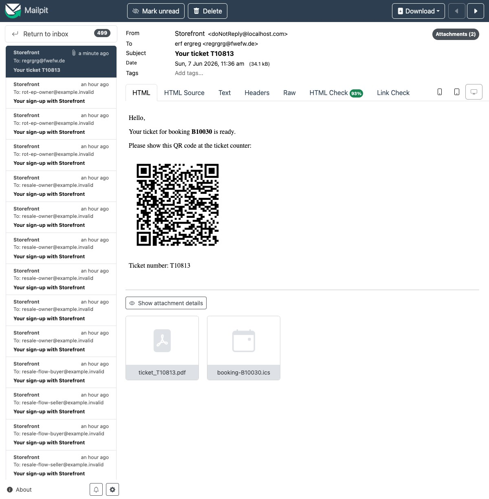
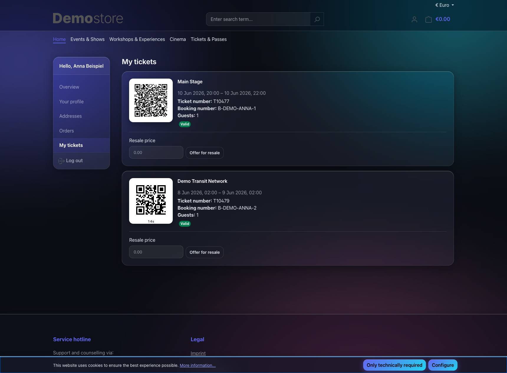
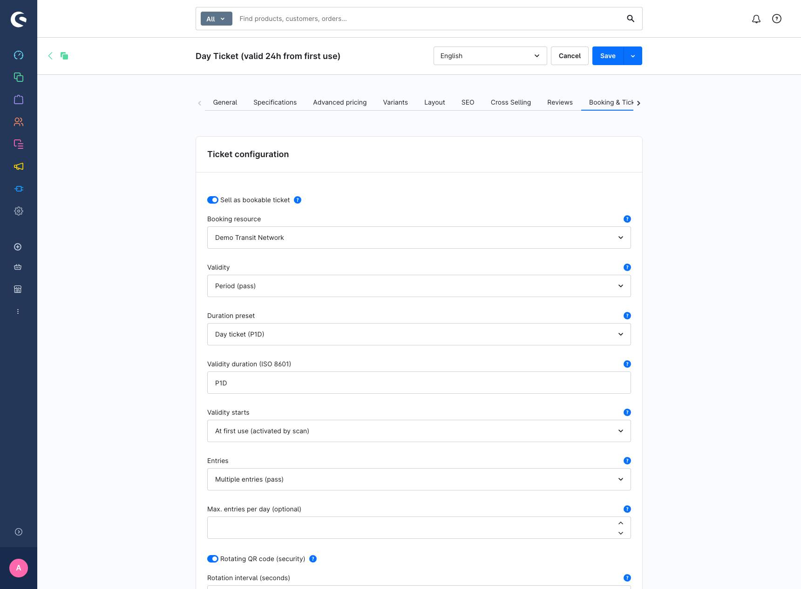
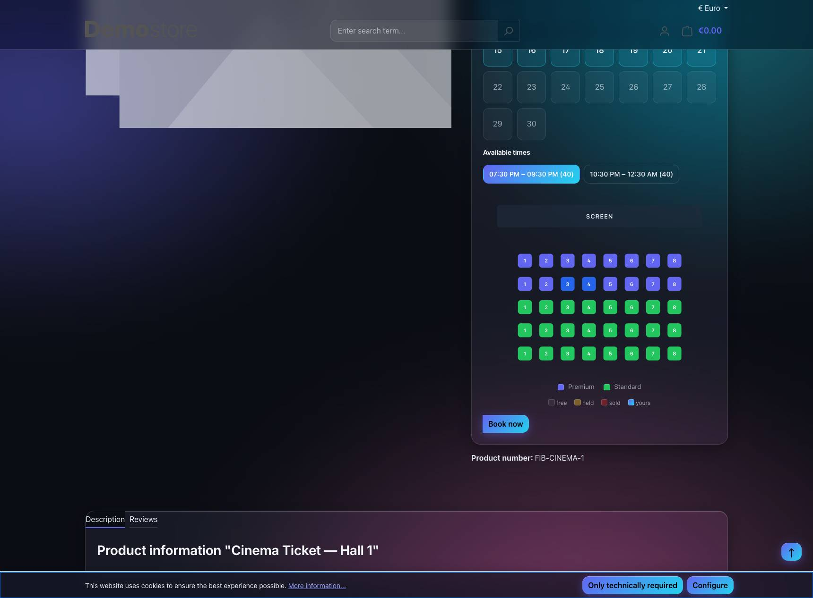
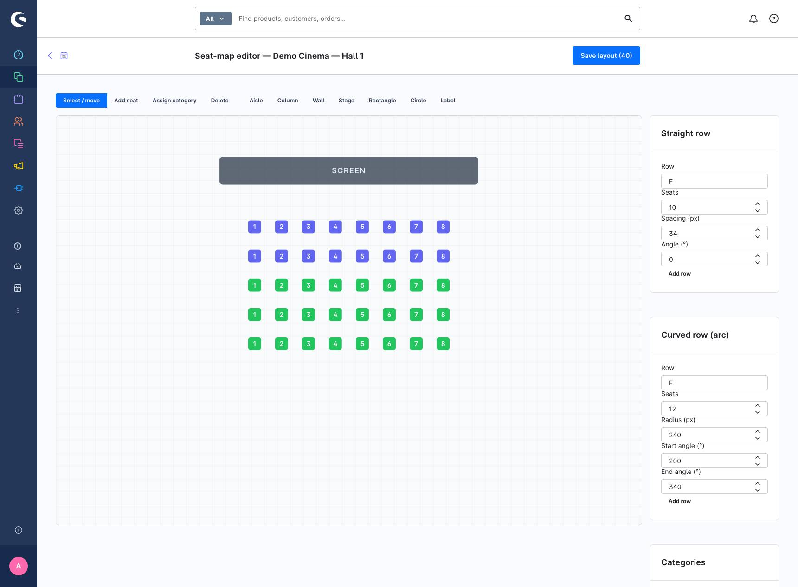
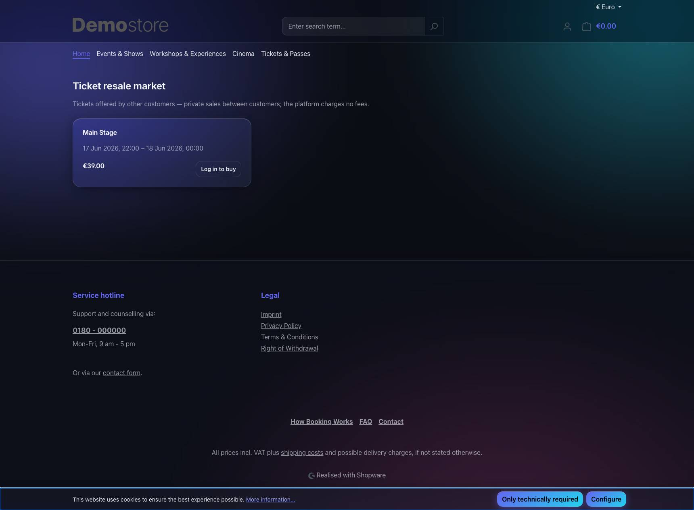

# FIB Booking System — Feature catalogue

A detailed walk-through of every core feature, what it does, how it is built,
and exactly which tests cover it. Screenshots are from the seeded demo
(`make up` → `fib-booking:demodata`).

> Test counts as of this revision: **185 PHP integration/unit tests** (+8
> demo-data) and **JS unit tests** — seat-picker 15, scanner 35, admin 36.
> Run: `make test` (PHP), and the vitest suites under
> `apps/seat-picker`, `apps/scanner`, `src/Resources/app/administration`.

---

## 1. Bookings, slots & capacity

Operator-defined **resources** (a hall, room, transit network) carry
**time slots** with a capacity. The storefront booking **calendar** (CMS
element + product detail) shows day availability (free / partial / sold-out)
and lets the visitor pick a slot. A **hold** reserves capacity for a short TTL
during checkout; on order placement it converts to a **reservation**.

Overbooking is structurally impossible: capacity is counted with a pessimistic
`FOR UPDATE` read before the hold insert, and seat claims use a `UNIQUE`
insert-wins guard.

**Tested by:** `SlotAvailabilityTest`, `BookingHoldQuotaTest`,
`BookingReservationResurrectionTest`, `BookingConsistencyCheckTest`,
`ReservationExpirationTest`.

---

## 2. Generic validity model

One flexible ticket model spans event tickets, day/monthly/annual passes and
transit fares: **mode** (slot · period · unlimited) × **anchor**
(purchase · first-use · customer-chosen start) × **entry policy**
(single · multi, optional max entries/day). The resolved validity is
**snapshotted onto the ticket at issue**, so later product reconfiguration
never changes already-sold tickets.

**Tested by:** `TicketValidityResolverTest` (matrix), `TicketSlotWindowTest`
(slot windows, early entry), `TicketScanServiceTest` (first-use activation,
multi-entry daily limit).

---

## 3. Tickets, QR & wallet passes

Each confirmed reservation issues a QR ticket — **one ticket per claimed seat**
for seat maps. Scan tokens are stored **hashed** (lookup) + **AES-256-GCM
encrypted** (recovery); the plaintext is never persisted. Delivery: PDF order
document, e-mail, and Apple/Google **wallet passes** (signed, no API round-trip
until the holder clicks).

**Tested by:** `TicketDocumentPdfTest`, `WalletLinkSignerTest`,
`GoogleWalletLinkGeneratorTest`, `TokenCipherTest`, `BookingTicketRevocationTest`,
`BookingNumberRangeTest`.

### 3a. Calendar invite (.ics) in the confirmation email — optional per product

The confirmation mail carries an **iCalendar invite** for the booked slot next
to the ticket PDF. With a shop email configured it's a `METHOD:REQUEST` the
customer can **accept/decline**; otherwise an "add to calendar" event. It is
**opt-out per product, enabled by default** (admin: *Product → Booking*),
snapshotted onto the ticket at issue like the other settings.

**Tested by:** `IcsCalendarGeneratorTest` (REQUEST vs PUBLISH, UTC, RFC-5545
escaping + 75-octet folding); per-product snapshot rides `TicketSlotWindowTest`/
`TicketScanServiceTest`. Design: [`CALENDAR_INVITE.md`](CALENDAR_INVITE.md).

---

## 4. Rotating QR codes (TOTP) — optional per product

The anti-sharing feature: the entry code **rotates every window** (TOTP,
RFC 6238) instead of being a static token. A screenshot is worthless after the
window passes. **Single-use per window** (a consumed window can't be redeemed
again) and **online verification** at the scanner. Enabled per product in the
admin; snapshotted onto the ticket. The account page shows the **live code with
a countdown**, refetched each window; the secret never leaves the server.
PDF/mail/wallet show a note instead of a dead static code (native wallet
rotating barcodes are a documented follow-up — see `ROTATING_QR.md`).

**Tested by:** `RotatingCodeServiceTest` (unit: window stability, ±1 drift,
rejection, wire round-trip, clamping, countdown), `TicketScanServiceTest`
(valid burns the window, replay rejected, wrong code / stale static token /
non-rotating / unknown), `RotatingQrEndpointTest` (owner-only, verifiable code),
`GoogleWalletLinkGeneratorTest` (rotating omits the static barcode + adds a
note), scanner `api.test.js` (rotating wire accepted/forwarded). Full design:
[`ROTATING_QR.md`](ROTATING_QR.md).

---

## 5. Numbered seating + free-form 2D editor

Cinema-style seat maps with claim-on-hold and live Mercure SSE updates. The
storefront **seat picker** (Vue island, TypeScript) renders the room; seats
colour by **category** (price tier) with free / held / sold / selected states.

For irregular venues, an optional **2D layout editor** in the admin lets the
operator draw seats, blockers (aisle/column/wall/stage), free-form shapes and
labels, in **straight, rotated or curved (arc) rows**. The curve maths lives in
the editor's generation tools; persisted seats are flat points `(x, y,
rotation)`, so the picker just renders points. The viewBox auto-fits the room.

**Tested by:** `SeatClaimFlowTest` (claim race, one-ticket-per-seat, free/held/
sold read model, **layout JSON + per-seat rotation/category exposure**),
`SeatmapUpdatePublisherTest` (dedupe/flush/failure), seat-picker
`selection.test.ts` (selection, reconcile, **fitContentBox**, **seatFill**,
category colours), admin `seat-layout.test.js` (straight/rotated/arc generation,
element creation, serialize, reuse-by-position plan) + `grid-generator.test.js`.
Design: [`SEAT_EDITOR.md`](SEAT_EDITOR.md), [`SEATING_PLAN.md`](SEATING_PLAN.md).

---

## 6. Scanning & access control

A least-privilege **scanner app** (own ACL role `fib_booking.ticket_scan`, no
entity-write rights) does race-safe check-in/out with re-entry, daily limits,
expiry/revocation verdicts and an **append-only audit log** (only a token
fingerprint is stored). Check-out is an opt-in plugin config.

**Tested by:** `TicketScanServiceTest` (verdict matrix, replay, re-entry,
check-out), `ScanLogGateAndRetentionTest` (gate label, anonymisation), scanner
`api.test.js` + `camera.test.js`.

---

## 7. Resale & auctions (private C2C, zero fee)

Secondary market: a holder lists a ticket, another customer buys it; the
platform handles the **transfer by token rotation** (the seller's copy is
provably dead). Guardrails: only the owner lists, cutoff before the slot,
anti-scalping price cap (with lineage), **one live listing per ticket**
(insert-wins UNIQUE), **double-sell guard** (atomic claim at order placement),
**scan-then-sell guard** (using the ticket cancels the listing). The platform
takes **no fee** (private C2C, by legal design).

The market is reachable under a clean, canonical **SEO URL** `/resale-market`
(a real `seo_url` entry per sales-channel × language; the technical
`/fib-booking/resale` route 301-redirects to it, exactly like every product/
category). The demo ships a **navigation menu item** for it as a category of
type *Link* → *External* pointing at that slug, so a merchant can move or
rename it like any other menu entry.

**Tested by:** `ResalePhaseOneTest` (transfer token rotation, listing
guardrails, one-live-listing race), `ResaleFixedPriceFlowTest` (cart pricing,
settlement + ownership transfer, refund unwind, atomic claim, scan-then-sell),
`BookingPaymentStateSubscriberTest` (settle/revoke routing),
`SeededShopStructureTest` (resale link-category points at the `/resale-market`
SEO slug). Design: [`RESELL_PLAN.md`](RESELL_PLAN.md).

---

## 8. Statistics

Purchase and **dwell-time** (check-in/out) tracking behind its own ACL
(`fib_booking.statistics`), exposed via Admin API + scanner dashboard.

**Tested by:** `BookingStatisticsServiceTest`.

---

## What is intentionally NOT unit-tested

- **Thin controllers / Twig templates** — logic lives in tested services
  (e.g. the rotating-QR route is a thin wrapper over the tested
  `WalletPassService::rotatingQrForOwner`; `BookingWidgetTemplateTest` asserts
  the template structure instead).
- **Vue/admin components** — interaction-heavy; their pure logic is extracted
  into unit-tested modules (`seat-layout.js`, `selection.ts`, `useSeatmap`
  helpers, scanner `api.js`).
- **Native Apple/Google rotating barcodes** — provider-gated / needs live
  device verification; deferred and documented in `ROTATING_QR.md`.
